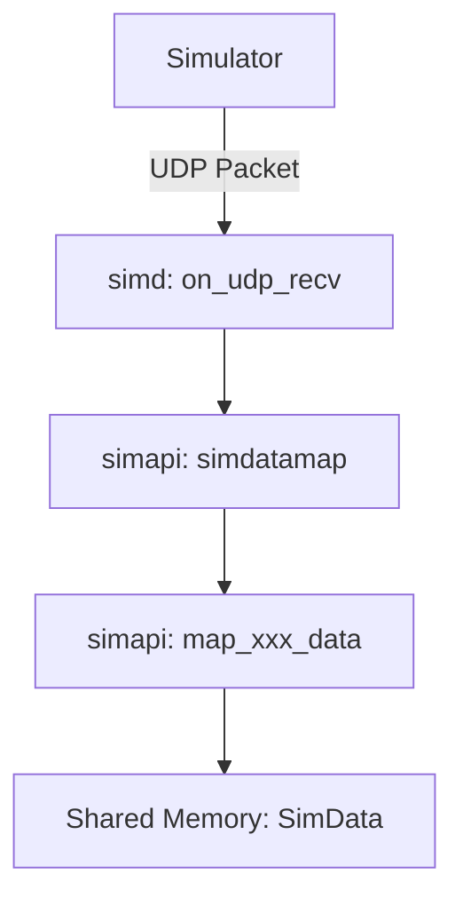

# UDP Telemetry Support in SimAPI

SimAPI supports simulators that output telemetry data over UDP. This document explains the architecture and how to implement support for new UDP-based simulators.

## Architecture Overview

The UDP support is integrated into the `simd` daemon and the `simapi` library.

### 1. Reception (simd)

The `simd` daemon handles the UDP socket lifecycle:
- **Initialization**: `startudp(port)` initializes a `uv_udp_t` socket using `libuv`.
- **Callback**: `on_udp_recv` is triggered whenever a packet arrives.
- **Data Flow**: The raw buffer is passed to `simdatamap` with the `udp` flag set to `true`.

### 2. Mapping (simapi)

The mapping logic resides in `simapi/mapping/`. For UDP simulators, the `base` parameter in `map_xxx_data` points to the raw packet buffer.

- **DiRT Rally 2.0**: Uses `map_dirt_rally_2_data` to process the "extradata=3" packet.
- **Inputs**: Raw fields like throttle/brake are mapped directly to `SimData`.
- **Calculations**: Some values (like Lateral G-force or Euler angles) are derived from world vectors and velocities.

## Implementing New UDP Simulators

To add support for a new UDP-based simulator:

1.  **Define Packet Structure**: Create a header in `include/` (e.g., `mynewsimdata.h`) with the packed struct representing the UDP packet.
2.  **Add Mapper**: Create `simapi/mapping/mynewsimmapper.c` and implement the mapping function.
3.  **Update simmapper.c**:
    - Add the new simulator to `SimulatorEXE` and `SimulatorAPI` enums.
    - Update `getSim` to detect the running process and call `setup_udp(port)`.
    - Update `simdatamap` to call your new mapper.
4.  **Update simmap.h**: Add a struct for the new simulator to the `SimMap` union to persist state (if needed, e.g., for acceleration calculations).

## Configuration

UDP support usually requires zero-configuration in `simapi` as it automatically detects the simulator and binds to the correct port. However, ensured the simulator itself is configured to send data to `127.0.0.1` on the expected port (e.g., `20777` for DiRT Rally 2.0).
